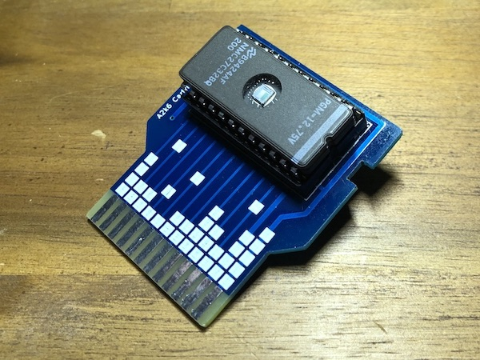

# A2k6 Cartridge

A cartridge PCB for the Atari 2600 for housing a 2732 EPROM and a 74LS04 hex inverter IC.

## Producing a PCB

Download the [a2k6-cart-gerbers.zip](https://github.com/sarweiler/a2k6-cart/releases/latest/download/a2k6-cart-gerbers.zip) file for the latest release, upload the zip archive to a PCB manufacturer of your choice, and order a PCB. Make sure to choose 1.6 mm for PCB thickness (for many manufacturers this is the default) and choose a color for the solder mask that you like.

## EPROMs

So far I could only test it with one EPROM model, the National Semiconductors NMC27C32BQ200, because it's the only one I have on hand. Others with similar pin outs may work, too. If you've successfully tested one, feel free to message me, and I'll keep a list here.

## Using the PCB

The PCB fits in a standard Atari 2600 game cartridge case ([tested with a Starmaster case](images/pcb-case.jpg)). In my tests, the EPROM *with* a socket unfortunately was just a bit too tall, so if you plan to put the PCB in a case, I think the EPROM must be soldered to the PCB.

On the PCB, the side with the square pattern (the side with the EPROM) is the "label" side, and should face towards the back of the console when inserting it.

